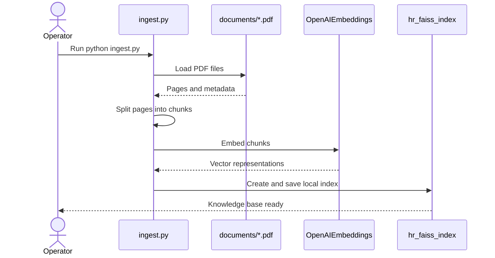
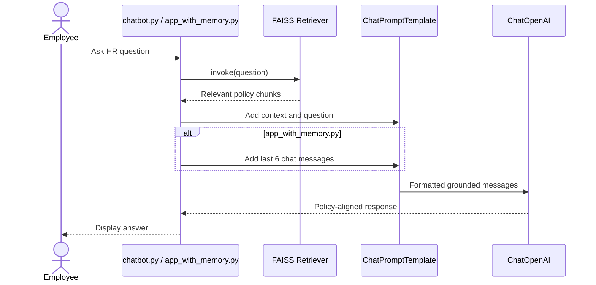

Below is a **ready-to-copy `README.md`** for your **HR RAG Support Chatbot project**.
It is **industry-style**, **clear**, and suitable for **GitHub, internal docs, or teaching material**.

---

# HR Support Chatbot (RAG-Based)

## Overview

This project implements a **Retrieval-Augmented Generation (RAG)** based **HR Support Chatbot** that answers employee questions using official company HR documents.

The chatbot is designed to:

* Provide **accurate, policy-aligned answers**
* Prevent hallucinations by grounding responses in company PDFs
* Support **context-aware follow-up questions**
* Be easily extendable to production-grade HR systems

---

## Key Features

* **PDF-based Knowledge Source**
  Uses company HR policy documents such as:

  * Welcome & company overview
  * Onboarding process
  * Code of conduct
  * Compensation & benefits
  * Leave & time-off policies
  * IT usage & security policy
  * Workplace safety guidelines

* **Retrieval-Augmented Generation (RAG)**
  Answers are generated by combining:

  * Semantic search over HR documents
  * Large Language Model (LLM) reasoning

*  **Context-Aware Conversations**
  Supports follow-up questions by maintaining chat history.

* **Hallucination Control**
  If information is not present in HR documents, the chatbot explicitly says:

  > “I’m not sure based on current HR policies.”

* 💻 **Streamlit UI**
  Simple chat interface suitable for demos and internal tools.

---

## Architecture

The following UML-style diagrams show the offline indexing pipeline and the two chatbot entry points.

### Component and Class Relationships

```mermaid
classDiagram
  class ingest_py {
    +DATA_FOLDER: str
    +VECTOR_DB_PATH: str
    +load PDFs()
    +split documents into chunks()
    +create embeddings()
    +save FAISS index()
  }

  class chatbot_py {
    +load FAISS index()
    +create retriever(k=4)
    +create ChatOpenAI()
    +chat()
  }

  class app_with_memory_py {
    +load_vectorstore()
    +load_llm()
    +session_state.messages
    +render Streamlit chat UI()
    +retrieve latest question()
    +include chat history in prompt()
  }

  class PDFDocuments {
    <<input>>
    HR policy PDFs
  }

  class FAISSIndex {
    <<persistent store>>
    hr_faiss_index
  }

  class Retriever {
    <<LangChain>>
    search_kwargs: k=4
  }

  class OpenAIEmbeddings {
    model: text-embedding-3-small
  }

  class ChatOpenAI {
    model: gpt-4o-mini
    temperature: 0
  }

  class PromptTemplate {
    HR context
    Employee question
    Optional conversation history
  }

  PDFDocuments --> ingest_py : loaded by
  ingest_py --> OpenAIEmbeddings : embeds chunks
  ingest_py --> FAISSIndex : saves
  chatbot_py --> FAISSIndex : loads
  app_with_memory_py --> FAISSIndex : loads
  chatbot_py --> Retriever : invokes
  app_with_memory_py --> Retriever : invokes
  Retriever --> OpenAIEmbeddings : queries vectors
  chatbot_py --> PromptTemplate : formats context
  app_with_memory_py --> PromptTemplate : formats context + history
  PromptTemplate --> ChatOpenAI : sends messages
```



### Ingestion Sequence



### Chatbot Runtime Sequence



`chatbot.py` runs the terminal chat loop. `app_with_memory.py` runs the Streamlit interface and stores messages in `st.session_state`; retrieval still uses only the latest employee question.

---

## Tech Stack

* **Python**
* **OpenAI API**

  * `gpt-4o-mini` (chat model)
  * `text-embedding-3-small` (embedding model)
* **LangChain**
* **FAISS** (vector database)
* **Streamlit** (UI)
* **PyPDF** (PDF ingestion)

---

## Project Structure

```
hr_rag_chatbot/
│
├── document/
│   ├── welcome and company overview.pdf
│   ├── onboarding process.pdf
│   ├── General emplyement policy.pdf
│   ├── code_of_conduct.pdf
│   ├── compensation_benefits.pdf
│   ├── Employee benifit.pdf
│   ├── leave_policy.pdf
│   ├── it_security_policy.pdf
│   └── workplace_safety.pdf
│
├── ingest.py                # One-time PDF ingestion & indexing
├── app.py                   # Streamlit RAG chatbot (no memory)
├── app_with_memory.py       # Streamlit RAG chatbot (context-aware)
├── requirements.txt
├── .env
└── README.md
```

---

## Setup Instructions

### 1. Install Dependencies

```bash
pip install -r requirements.txt
```

### 2. Configure Environment Variables

Create a `.env` file:

```
OPENAI_API_KEY=your_openai_api_key
```

---

## PDF Ingestion (One-Time Step)

This step converts HR PDFs into vector embeddings.

```bash
python ingest.py
```

What this does:

* Loads all PDFs from `data/`
* Splits them into semantic chunks
* Generates embeddings using OpenAI
* Stores vectors locally using FAISS

---

## Running the Chatbot

### Without Memory

```bash
streamlit run app.py
```

### With Context-Aware Memory (Recommended)

```bash
streamlit run app_with_memory.py
```

---

## Example Questions

```
What is the onboarding process for new employees?
How many leave days am I entitled to?
Can unused leave be carried forward?
What is the IT security policy on passwords?
What should I do in case of a workplace safety incident?
```

---

## Memory Handling

* Chat history is stored in Streamlit session state
* Previous turns are included in the prompt to support follow-ups
* Retrieval is always performed using the **latest question only** to avoid noise

---

## Design Principles

* **LLM does not act as the source of truth**
  HR documents are the authority.

* **Retrieval before generation**
  Answers are grounded in retrieved policy text.

* **Fail-safe behavior**
  The chatbot refuses to answer when information is missing.

---

## Limitations

* No role-based access control 
* No document citations per answer
* Local FAISS storage (not distributed)

---


## Disclaimer

This chatbot is intended for **informational purposes only**.
Official HR decisions should always follow company policy and HR approval processes.

---

## License

Internal / Educational Use Only

--